# 货船智能机舱管理系统

基于现代技术栈构建的船舶机舱智能监控与管理平台，实现设备实时监测、智能告警、健康评估和数据管理功能。

---

## 系统概述

本系统为货船机舱提供全方位的智能化管理解决方案，通过实时数据采集、智能分析和可视化展示，帮助船员和管理人员及时掌握船舶设备运行状态，预防故障发生，提高运营安全性和效率。

### 核心特性

- **实时监测** - 多系统设备数据实时采集与展示
- **智能告警** - 多级告警机制，支持实时和历史告警管理
- **健康评估** - 基于监测数据的设备健康度自动评估
- **数据管理** - 历史数据查询、导入导出功能
- **视情维护** - 基于设备状态的智能维护建议
- **辅助决策** - 数据分析驱动的决策支持

---

## 功能模块

### 1. 控制台
系统首页仪表盘，集中展示：
- 核心监测点实时数据
- 实时告警状态概览
- 船舶整体健康度评分

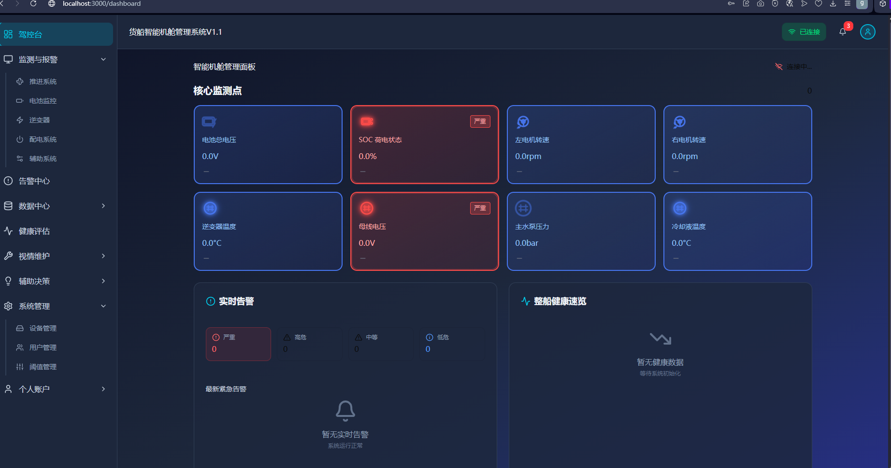

### 2. 监测与报警

#### 2.1 推进系统
监控左右推进装置的运行状态：
- 电机电压、电流
- 电机转速、功率
- 绕组温度、轴承温度
- 油压、油温

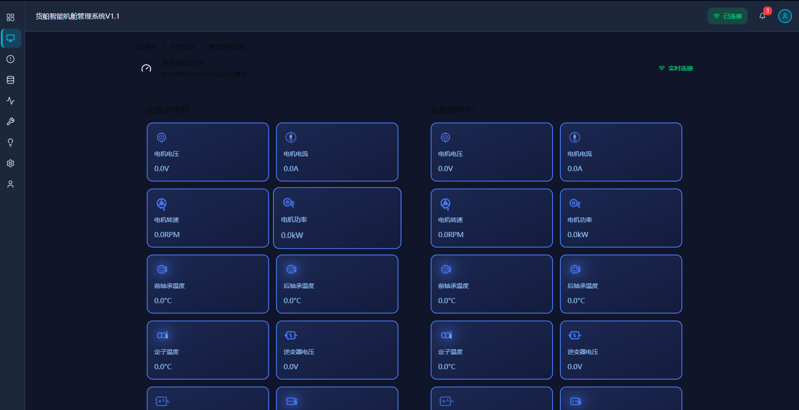

#### 2.2 电池监控
电池系统全方位监测：
- 总电压、单体电压
- 电池温度、环境温度
- SOC/SOH 状态
- 绝缘电阻、故障状态

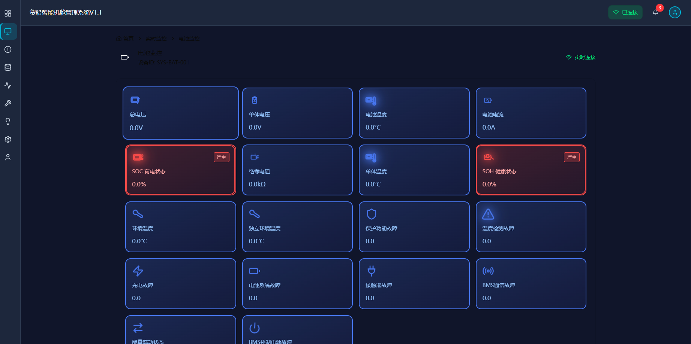

#### 2.3 逆变器监控
1#/2#日用逆变器实时监测：
- 直流输入电压、交流输出电压
- 输出功率、电抗器温度

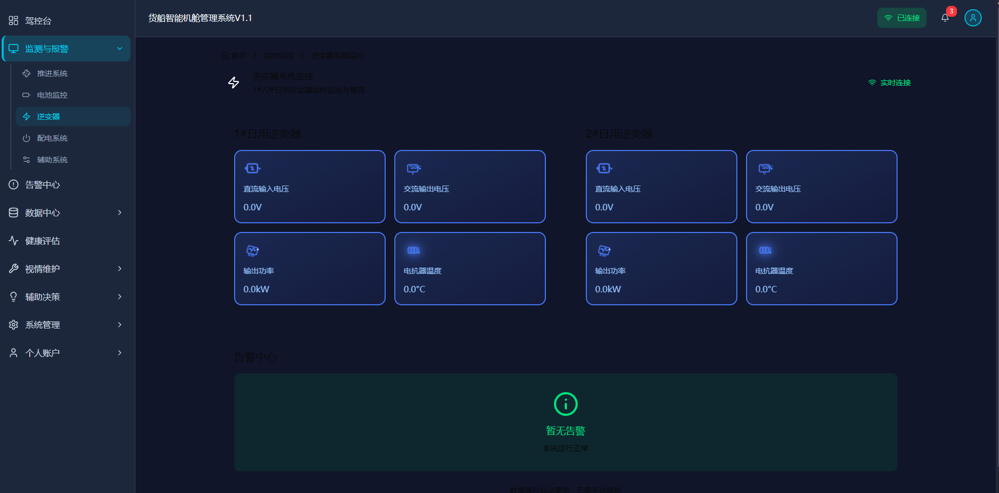

#### 2.4 配电系统
直流配电板状态监控：
- 直流母线电压、电流、功率
- 绝缘电阻、电池电量

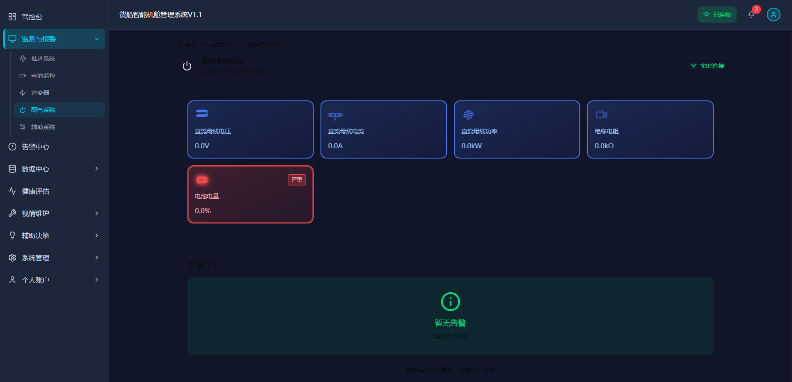

#### 2.5 辅助系统
舱底水系统和冷却水泵系统监测：
- 集水井水位
- 冷却水温度、压力、流量
- 泵运行状态

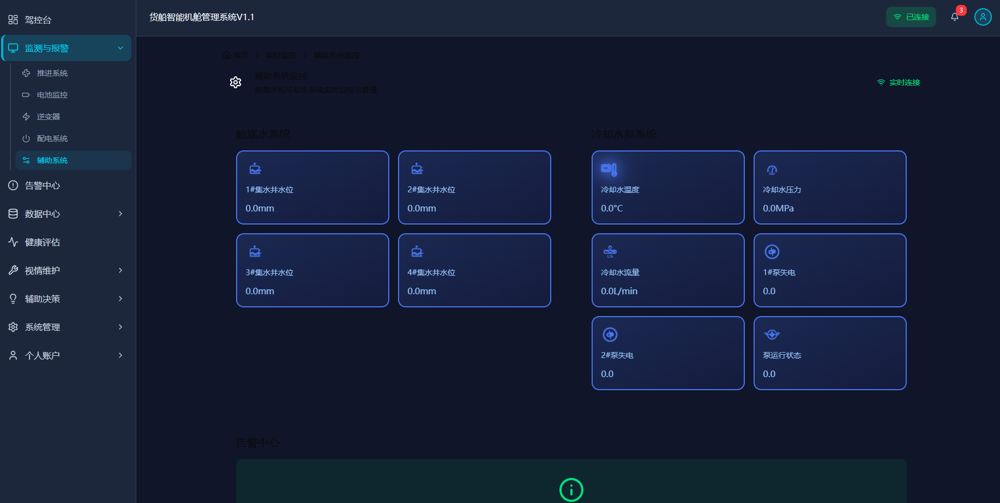

### 3. 告警中心
统一管理实时告警和历史告警：
- **实时告警** - WebSocket 自动推送，无需手动刷新
- **历史告警** - 完整告警记录查询与追溯
- **分级管理** - 待处理、严重、紧急三级分类

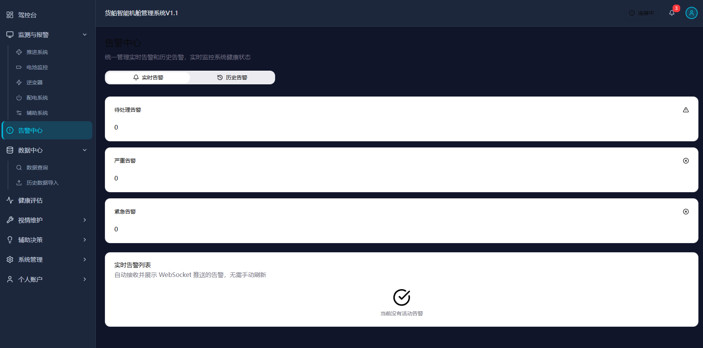

### 4. 数据中心

#### 4.1 数据查询
多维度设备数据查询：
- 设备选择（推进、电池、逆变器、配电、辅助）
- 监控参数筛选（电压、电流、温度、转速、SOC、压力、功率、效率）
- 时间范围选择
- 数据导出功能

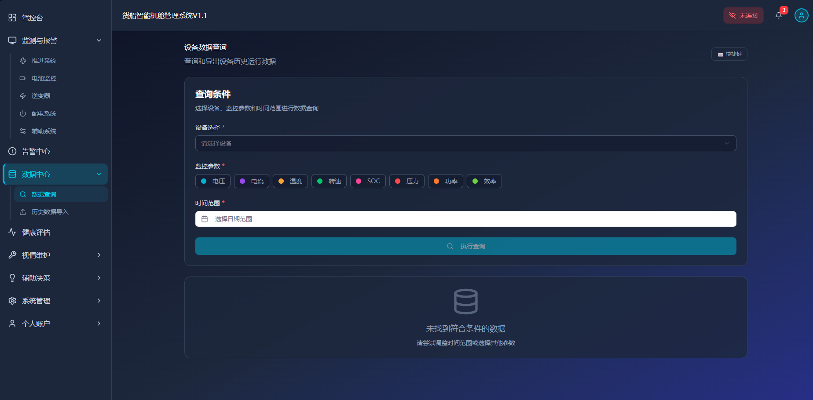

#### 4.2 历史数据导入
支持批量数据导入：
- 文件格式：CSV、Excel（.xls、.xlsx）
- 最大文件大小：50MB
- 导入进度实时显示
- 导入历史记录管理

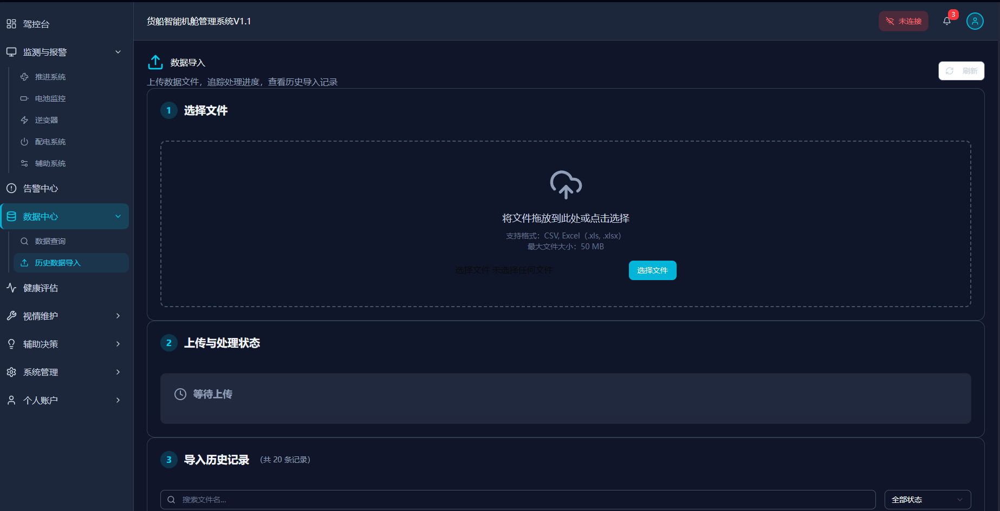

### 5. 健康评估
各系统健康度综合评估：
- 电池系统健康度
- 推进系统健康度
- 逆变器系统健康度
- 配电系统健康度
- 辅助系统健康度

基于历史监测数据自动生成健康报告，提供维护建议。

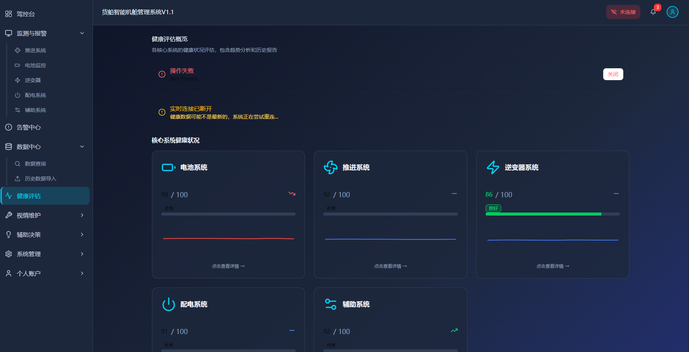

### 6. 系统管理

#### 6.1 设备管理
设备信息集中管理：
- 设备编码、名称、类型
- 安装位置、运行状态
- 创建时间追踪

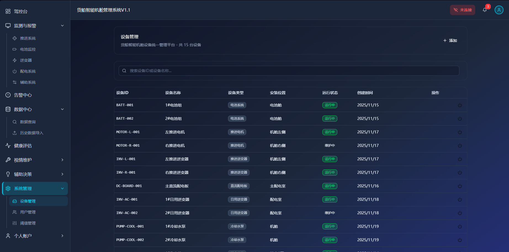

#### 6.2 用户管理
系统用户权限管理：
- 用户名、姓名、邮箱
- 角色分配（系统管理员、船长、轮机长、维护工程师等）
- 账户状态管理
- 最近登录时间

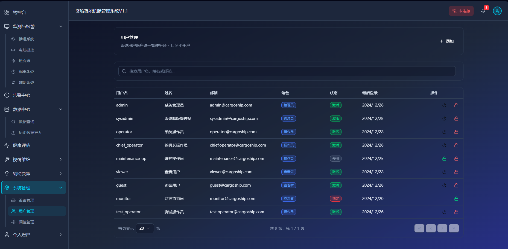

#### 6.3 阈值管理
告警阈值配置：
- 监测指标配置
- 多级阈值设置（上限、下限）
- 告警等级定义
- 规则状态管理

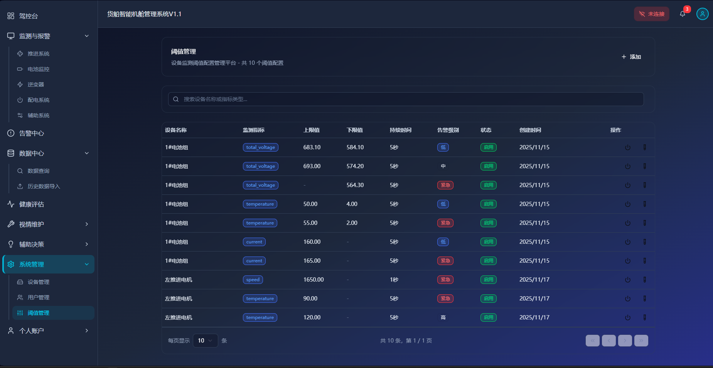

### 7. 个人账户
个人信息管理：
- 基本信息查看与修改
- 密码修改
- 账户状态

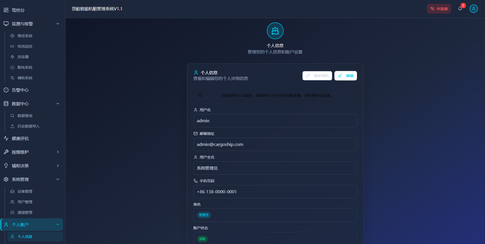

---

## 技术架构

### 前端技术栈

| 技术 | 版本 | 用途 |
|------|------|------|
| React | 18.3.1 | UI 框架 |
| TypeScript | 5.9.3 | 类型安全 |
| Vite | 6.3.5 | 构建工具 |
| Tailwind CSS | - | 样式框架 |
| Radix UI | - | 组件库 |
| Recharts | 2.15.2 | 数据可视化 |
| Socket.io-client | 4.8.1 | 实时通信 |
| Zustand | 4.4.7 | 状态管理 |
| React Router | 7.9.6 | 路由管理 |

### 后端技术栈

| 技术 | 版本 | 用途 |
|------|------|------|
| NestJS | 11.x | 后端框架 |
| TypeScript | 5.7.3 | 开发语言 |
| TypeORM | 0.3.27 | ORM 框架 |
| MySQL | 8.0+ | 数据库 |
| Socket.io | 4.8.1 | WebSocket 服务 |
| JWT | - | 身份认证 |
| Swagger | - | API 文档 |

---

## 项目结构

```
cargo-ship-manage/
├── cargo-ship-frontend/          # 前端项目
│   ├── src/
│   │   ├── components/           # 公共组件
│   │   ├── pages/                # 页面组件
│   │   ├── services/             # API 服务
│   │   ├── store/                # 状态管理
│   │   ├── hooks/                # 自定义 Hooks
│   │   ├── utils/                # 工具函数
│   │   └── styles/               # 样式文件
│   ├── docs/data/                # API 文档
│   └── package.json
│
├── cargo-ship-backend/           # 后端项目
│   ├── src/
│   │   ├── modules/              # 功能模块
│   │   │   ├── auth/             # 认证模块
│   │   │   ├── users/            # 用户模块
│   │   │   ├── equipment/        # 设备模块
│   │   │   ├── monitoring/       # 监测模块
│   │   │   ├── alarm/            # 告警模块
│   │   │   └── health/           # 健康评估模块
│   │   ├── database/             # 数据库实体
│   │   ├── common/               # 公共工具
│   │   └── config/               # 配置文件
│   ├── docs/                     # 项目文档
│   └── package.json
│
└── snapshots/                    # 界面截图
```

---

## 快速开始

### 环境要求

- Node.js 18.x 或更高版本
- MySQL 8.0 或更高版本
- npm 8.x 或更高版本

### 后端部署

```bash
# 进入后端目录
cd cargo-ship-backend

# 安装依赖
npm install

# 配置环境变量
cp .env.example .env
# 编辑 .env 文件，配置数据库连接信息

# 创建数据库
mysql -u root -p
CREATE DATABASE cargo_ship_db CHARACTER SET utf8mb4 COLLATE utf8mb4_unicode_ci;

# 运行数据库迁移
npm run migration:run

# 启动开发服务器
npm run start:dev
```

后端服务默认运行在 `http://localhost:3000`

### 前端部署

```bash
# 进入前端目录
cd cargo-ship-frontend

# 安装依赖
npm install

# 启动开发服务器
npm run dev
```

前端服务默认运行在 `http://localhost:5173`

### 数据初始化

```bash
# 填充客户规则（告警阈值）
cd cargo-ship-backend
npm run seed:customer-rules

# 填充监测点数据
npm run seed:monitoring-points
```

---

## API 文档

启动后端服务后，访问 Swagger UI 查看完整 API 文档：

```
http://localhost:3000/api/docs
```

---

## 实时通信

系统使用 WebSocket 实现实时数据推送：

- **告警推送** - 实时告警信息自动推送到前端
- **状态更新** - 设备状态变更实时同步
- **房间机制** - 基于权限的消息定向广播

---

## 开发指南

### 前端开发

```bash
# 生成 API 客户端（根据后端 Swagger 文档）
npm run generate:api

# 构建生产版本
npm run build
```

### 后端开发

```bash
# 生成数据库迁移
npm run migration:generate -- -n MigrationName

# 创建空迁移
npm run migration:create -- MigrationName

# 运行测试
npm run test

# 代码格式化
npm run format
npm run lint
```

---

## 系统特点

### 深色主题界面
采用现代化的深色 UI 设计，适合船舶机舱环境长时间使用，减少视觉疲劳。

### 响应式布局
适配不同尺寸的显示设备，支持桌面、平板等多种终端。

### 实时数据可视化
使用卡片式布局展示监测数据，异常数据高亮显示，直观清晰。

### 多级告警机制
支持 1级/2级/3级 多级告警，不同级别采用不同颜色标识：
- 🟢 正常 - 绿色
- 🟡 一般 - 黄色
- 🟠 严重 - 橙色
- 🔴 紧急 - 红色

---

## 许可证

私有项目 - 未经许可不得复制或使用

---

## 支持与联系

如有问题或建议，请联系开发团队。
