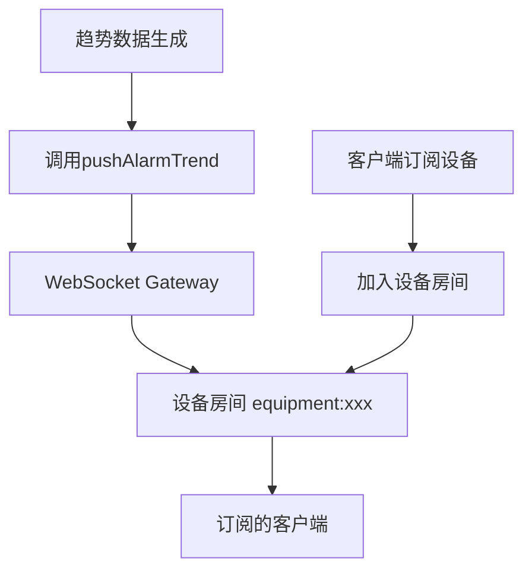

# alarm:trend 实时事件分析报告

## 概述

本文档详细分析了货船智能机舱管理系统中 `alarm:trend` 实时事件的实现逻辑、使用场景和扩展可能性。

## 分析过程

### 1. 事件发现

通过搜索代码库中的 `alarm:trend` 关键词，发现以下相关文件：
- `src/modules/alarm/alarm-push.service.ts` - 事件实现
- `src/modules/alarm/alarm-push.service.spec.ts` - 单元测试
- `docs/data/websocket-api.md` - API文档
- `docs/data/websocket_api_spec.md` - 详细API规范

### 2. 核心实现分析

#### 2.1 AlarmPushService 实现

```typescript
/**
 * 推送告警趋势数据
 *
 * @param equipmentId 设备ID
 * @param trendData 趋势数据
 */
async pushAlarmTrend(equipmentId: string, trendData: any): Promise<void> {
  this.logger.debug(`推送设备 ${equipmentId} 的告警趋势数据`);

  this.websocketGateway.sendToEquipment(
    equipmentId,
    'alarm:trend',
    trendData,
  );
}
```

**关键特征**:
- 使用 `sendToEquipment` 方法推送到特定设备房间
- 包含调试日志记录
- 接受任意格式的趋势数据（any类型）

#### 2.2 测试用例分析

```typescript
describe('推送告警趋势 (pushAlarmTrend)', () => {
  it('应该成功推送告警趋势数据到设备房间', async () => {
    const equipmentId = 'equipment-trend-001';
    const trendData = {
      equipmentId,
      period: '7d',
      totalAlarms: 15,
      criticalCount: 2,
      highCount: 5,
      mediumCount: 6,
      lowCount: 2,
      trend: 'increasing',
    };

    await service.pushAlarmTrend(equipmentId, trendData);

    expect(mockWebsocketGateway.sendToEquipment).toHaveBeenCalledWith(
      equipmentId,
      'alarm:trend',
      trendData,
    );
  });
});
```

### 3. API文档规范

#### 3.1 事件定义

**说明**: 推送设备的告警趋势统计数据

**目标房间**: `equipment:{equipmentId}`

**数据结构**:
```json
{
  "equipmentId": "SYS-BAT-001",
  "period": "7d",
  "totalAlarms": 15,
  "criticalCount": 2,
  "highCount": 5,
  "mediumCount": 6,
  "lowCount": 2,
  "trend": "increasing"
}
```

#### 3.2 字段说明

| 字段 | 类型 | 说明 |
|------|------|------|
| `equipmentId` | string | 设备ID |
| `period` | string | 统计周期（如"7d"表示7天） |
| `totalAlarms` | number | 该周期内的总告警数 |
| `criticalCount` | number | 严重告警数量 |
| `highCount` | number | 高级告警数量 |
| `mediumCount` | number | 中级告警数量 |
| `lowCount` | number | 低级告警数量 |
| `trend` | string | 趋势方向 |

### 4. 使用现状分析

#### 4.1 代码搜索结果

通过全局搜索发现：
- ✅ 事件方法已实现 (`AlarmPushService.pushAlarmTrend`)
- ✅ 单元测试已编写
- ✅ API文档已完善
- ❌ **没有找到任何调用此方法的代码**

#### 4.2 依赖关系分析

搜索了以下可能调用趋势推送的服务：
- `MonitoringService` - 监测数据服务，未调用
- `AlarmService` - 告警服务，未调用
- `ImportService` - 导入服务，未调用
- `HealthAssessmentService` - 健康评估服务，未调用

#### 4.3 定时任务检查

搜索了定时任务相关关键词：
- `@Cron` - 未找到
- `@Interval` - 未找到
- `scheduler` - 未找到

### 5. 功能状态评估

#### 5.1 当前状态

**功能完整度**: 60%
- ✅ 基础实现完成
- ✅ 测试覆盖完整
- ✅ 文档规范完整
- ❌ 实际调用逻辑缺失
- ❌ 数据生成逻辑缺失

#### 5.2 架构一致性

该实现完全符合系统的 WebSocket 架构模式：
- 使用设备房间机制实现精准推送
- 遵循事件的命名规范 (`domain:action`)
- 包含完整的日志记录
- 支持任意数据结构的灵活设计

## 技术架构分析

### 1. 事件流程图



### 2. 数据流向

```
趋势数据源 → AlarmPushService → WebsocketGateway → 设备房间 → 客户端
```

### 3. 房间机制

- **房间名称**: `equipment:{equipmentId}`
- **订阅方式**: 客户端通过 `subscribe:equipment` 事件订阅
- **推送目标**: 所有订阅该设备的客户端

## 潜在应用场景

### 1. 定时趋势分析

```typescript
// 每日零点执行告警趋势统计
@Cron('0 0 * * *')
async generateDailyTrends() {
  const equipmentList = await this.equipmentService.findAll();
  
  for (const equipment of equipmentList) {
    const trendData = await this.calculateTrend(equipment.id, '1d');
    await this.alarmPushService.pushAlarmTrend(equipment.id, trendData);
  }
}
```

### 2. 阈值触发

```typescript
// 当告警数量激增时触发趋势分析
async onAlarmThresholdExceeded(equipmentId: string) {
  const trendData = await this.calculateTrend(equipmentId, '1h');
  await this.alarmPushService.pushAlarmTrend(equipmentId, trendData);
}
```

### 3. 用户主动请求

```typescript
// WebSocket 请求事件处理
@SubscribeMessage('request:alarm:trend')
async handleTrendRequest(
  @ConnectedSocket() client: Socket,
  @MessageBody() data: { equipmentId: string, period: string }
) {
  const trendData = await this.calculateTrend(data.equipmentId, data.period);
  client.emit('alarm:trend', trendData);
}
```

### 4. 健康评估集成

```typescript
// 在生成健康报告时同步推送趋势
async generateHealthReport(equipmentId: string) {
  const report = await this.assessmentService.generateReport(equipmentId);
  
  if (report.alarmTrend) {
    await this.alarmPushService.pushAlarmTrend(equipmentId, report.alarmTrend);
  }
  
  return report;
}
```

## 扩展建议

### 1. 数据类型完善

当前使用 `any` 类型，建议定义明确的接口：

```typescript
interface AlarmTrendData {
  equipmentId: string;
  period: string;
  totalAlarms: number;
  criticalCount: number;
  highCount: number;
  mediumCount: number;
  lowCount: number;
  trend: 'increasing' | 'decreasing' | 'stable';
  generatedAt?: string; // 生成时间戳
}
```

### 2. 趋势计算算法

实现多种趋势计算方式：
- **线性回归**: 基于告警数量的线性趋势
- **移动平均**: 平滑短期波动
- **环比/同比**: 与历史同期比较
- **预测模型**: 基于机器学习的趋势预测

### 3. 缓存机制

```typescript
// 使用 Redis 缓存趋势数据，避免重复计算
async getCachedTrend(equipmentId: string, period: string): Promise<AlarmTrendData | null> {
  const cacheKey = `alarm:trend:${equipmentId}:${period}`;
  const cached = await this.redis.get(cacheKey);
  return cached ? JSON.parse(cached) : null;
}
```

### 4. 批量推送优化

```typescript
// 批量推送多个设备的趋势数据
async pushBatchTrends(trends: Array<{ equipmentId: string, data: AlarmTrendData }>) {
  const promises = trends.map(({ equipmentId, data }) => 
    this.pushAlarmTrend(equipmentId, data)
  );
  await Promise.all(promises);
}
```

## 客户端集成示例

### 1. React 组件示例

```typescript
function AlarmTrendWidget({ equipmentId }: { equipmentId: string }) {
  const [trend, setTrend] = useState<AlarmTrendData | null>(null);
  
  useEffect(() => {
    const socket = getSocket();
    
    socket.on('alarm:trend', (data: AlarmTrendData) => {
      if (data.equipmentId === equipmentId) {
        setTrend(data);
      }
    });
    
    socket.emit('subscribe:equipment', { equipmentId });
    
    return () => {
      socket.off('alarm:trend');
      socket.emit('unsubscribe:equipment', { equipmentId });
    };
  }, [equipmentId]);
  
  return (
    <div className="alarm-trend">
      <h3>告警趋势 ({trend?.period})</h3>
      <div className="trend-indicator">
        <span className={`status ${trend?.trend}`}>
          {trend?.trend === 'increasing' ? '上升' : 
           trend?.trend === 'decreasing' ? '下降' : '稳定'}
        </span>
      </div>
      <div className="alarm-counts">
        <div>总计: {trend?.totalAlarms}</div>
        <div>严重: {trend?.criticalCount}</div>
        <div>高级: {trend?.highCount}</div>
      </div>
    </div>
  );
}
```

### 2. 趋势图表集成

```typescript
// 使用 Chart.js 绘制趋势图
function AlarmTrendChart({ trendData }: { trendData: AlarmTrendData[] }) {
  const chartData = {
    labels: trendData.map(d => d.period),
    datasets: [{
      label: '总告警数',
      data: trendData.map(d => d.totalAlarms),
      borderColor: 'rgb(255, 99, 132)',
      backgroundColor: 'rgba(255, 99, 132, 0.2)',
    }]
  };
  
  return <Line data={chartData} />;
}
```

## 性能考虑

### 1. 推送频率

- **高频推送**: 实时趋势（每5分钟）- 适用于关键设备
- **中频推送**: 定时趋势（每小时）- 适用于普通设备  
- **低频推送**: 历史趋势（每天）- 适用于统计分析

### 2. 数据量优化

```typescript
// 使用数据压缩减少传输量
function compressTrendData(data: AlarmTrendData): CompressedTrendData {
  return {
    id: data.equipmentId,
    p: data.period,
    total: data.totalAlarms,
    severe: data.criticalCount,
    trend: data.trend[0], // 使用首字母
  };
}
```

### 3. 客户端节流

```typescript
// 使用防抖避免频繁更新
const debouncedUpdateTrend = debounce((trend: AlarmTrendData) => {
  updateTrendDisplay(trend);
}, 1000);
```

## 安全性考虑

### 1. 权限验证

确保只有订阅了设备的用户才能接收趋势数据：
- 使用现有的 WebSocket 认证机制
- 验证用户是否有设备访问权限
- 敏感趋势数据可能需要额外权限

### 2. 数据脱敏

对于敏感设备的趋势数据，考虑：
- 不推送具体的告警数量
- 使用相对值（如百分比、等级）
- 限制历史数据的详细程度

## 监控和日志

### 1. 推送监控

```typescript
// 监控推送成功率
private trackTrendPush(equipmentId: string, success: boolean) {
  this.metricsService.increment('alarm.trend.push', {
    equipmentId,
    success: success.toString(),
  });
}
```

### 2. 性能监控

```typescript
// 监控趋势计算耗时
async calculateTrendWithMetrics(equipmentId: string, period: string) {
  const start = Date.now();
  const result = await this.calculateTrend(equipmentId, period);
  const duration = Date.now() - start;
  
  this.metricsService.histogram('alarm.trend.calculation.duration', duration, {
    period,
  });
  
  return result;
}
```

## 总结

### 当前状态

`alarm:trend` 事件是一个**已实现但未激活**的功能，具备：
- ✅ 完整的基础实现
- ✅ 完善的测试覆盖
- ✅ 详细的 API 文档
- ❌ 缺少实际调用逻辑
- ❌ 缺少数据生成算法

### 技术价值

该功能为系统提供了：
- **趋势分析能力**: 帮助用户了解告警发展趋势
- **预测性维护**: 早期发现潜在问题
- **决策支持**: 基于数据趋势的运维决策
- **用户体验提升**: 实时的可视化趋势展示

### 启用建议

要完全启用此功能，建议按以下步骤进行：

1. **第一阶段**: 实现基础数据生成逻辑
2. **第二阶段**: 添加定时任务触发机制  
3. **第三阶段**: 集成到健康评估流程
4. **第四阶段**: 优化性能和缓存机制

这个功能展现了系统良好的扩展性设计，为后续的智能分析和预测性维护奠定了坚实基础。

---

**分析日期**: 2025-12-12  
**分析范围**: cargo-ship-backend v2.0.0  
**分析深度**: 源码级完整分析
