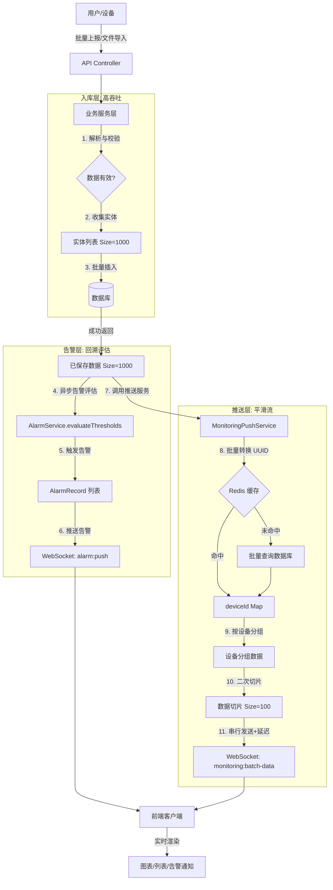

# 批量数据推送与入库性能优化方案

## 1. 背景与现状分析

经过对 `ImportService`（文件导入）和 `MonitoringService`（API上报）的深度审查，发现当前系统在处理批量数据时存在逻辑不统一和性能隐患。

### 1.1 现状对比

| 模块 | 场景 | 入库逻辑 | 推送逻辑 | 存在问题 |
| :--- | :--- | :--- | :--- | :--- |
| **MonitoringService** | 单条上报 | 单次 Insert | 立即调用 `pushNewData` | 无 (正常) |
| **MonitoringService** | **批量上报** | **循环逐条 Insert** (低效) | **无推送** | 1. 数据库交互次数过多 (N次)<br>2. 前端无法接收实时数据更新 |
| **ImportService** | 文件导入 | 分批 Batch Insert (高效) | **仅推最新一条** | 1. 数据丢失：导入的历史趋势数据前端不可见<br>2. 用户体验不一致 |

### 1.2 核心挑战

*   **大数据量冲击**：文件导入或批量 API 调用可能包含数千至数万条数据。
*   **前端性能瓶颈**：如果对几万条数据循环调用现有的 `pushNewData`，会导致后端发送数万次 WebSocket 消息，瞬间淹没前端客户端，导致浏览器卡顿或崩溃。
*   **网络 I/O 压力**：高频小包通讯不仅占用带宽，也增加了服务器 CPU 负担。

---

## 2. 解决方案：分批入库 + 分片推送

### 2.1 核心策略：入库大口吃，推送细嚼慢咽

**原则**：坚持**"先存后推"**，保证数据一致性（真实落盘才展示），同时通过**两级分片**平衡数据库性能与前端体验。

1.  **入库层 (Database Layer)**：
    *   **策略**：保持较大的 Batch Size (如 **1000条**)。
    *   **理由**：这是数据库事务处理的舒适区，能最大化吞吐量，减少事务提交开销。
    *   **时序**：必须等待入库成功后，才触发后续推送。绝不进行"乐观推送"，以防数据不一致。

2.  **推送层 (Push Layer)**：
    *   **策略**：在推送服务内部进行**二次分片** (如 **100条/Chunk**)。
    *   **理由**：将已入库的 1000 条大包，拆分为 10 个小包连续发送。避免 WebSocket 单帧过大导致的网络延迟，也防止前端 JS 线程长时间阻塞。

### 2.2 详细设计

#### A. 后端服务层改造 (`MonitoringPushService`)

新增 `pushBatchData(dataList: TimeSeriesData[])` 方法：

1.  **分组 (Grouping)**：按 `equipmentId` 对数据进行分组。
2.  **映射 (Mapping)**：将数据库 UUID 转换为业务 `deviceId` (使用批量查询 + 缓存策略)。
3.  **分片 (Chunking)**：
    *   **输入**：可能是一次性传入的 1000 条已入库数据。
    *   **处理**：内部循环，将其切分为 `CHUNK_SIZE` (建议 100) 的多个小数组。
4.  **推送 (Emitting)**：
    *   **串行发送** `monitoring:batch-data` 事件，确保消息顺序性。
    *   前端监听此事件，平滑地分批渲染数据。

**事件数据格式 (`monitoring:batch-data`)**：

```json
{
  "batchId": "batch-uuid-xxx",      // 批次唯一标识 (用于前端去重和排序)
  "equipmentId": "SYS-INV-1-001",   // 设备业务编号 (必填，前端用于路由数据到指定图表/组件)
  "data": [                         // 数据数组 (核心负载，建议 max 100条)
    {
      "id": "uuid-1",
      "timestamp": "2025-12-25T10:00:01.000Z",
      "metricType": "voltage",
      "monitoringPoint": "mp-1",
      "value": 220.5,
      "unit": "V",
      "quality": 192,
      "source": "import"
    }
    // ... 最多 100 条 ...
  ],
  "chunkIndex": 1,      // 当前分片序号 (从 1 开始)
  "totalChunks": 5,     // 总分片数
  "isHistory": true     // 标记是否为历史补录数据
}
```

**关键字段说明**：
- `batchId`: 同一批次数据共享同一 ID，前端可据此进行去重和排序
- `chunkIndex` / `totalChunks`: 前端可实现进度显示或缓冲策略

#### B. 设备 ID 映射缓存策略

**问题**：批量数据推送需要将数据库 UUID 转换为业务 `deviceId`，频繁查询会导致性能问题。

**解决方案**：实现两级缓存 + 批量查询机制

```typescript
// MonitoringPushService 实现示例
async convertUuidsToDeviceIds(uuids: string[]): Promise<Map<string, string>> {
  const result = new Map<string, string>();
  
  // 1. 从 Redis 批量获取缓存 (使用 MGET 命令)
  const cacheKeys = uuids.map(uuid => `equipment:uuid:${uuid}`);
  const cachedValues = await this.redis.mget(cacheKeys);
  
  const missingUuids: string[] = [];
  uuids.forEach((uuid, index) => {
    if (cachedValues[index]) {
      result.set(uuid, cachedValues[index]);
    } else {
      missingUuids.push(uuid);
    }
  });
  
  // 2. 批量查询数据库 (使用 IN 查询，非循环)
  if (missingUuids.length > 0) {
    const equipments = await this.equipmentRepo.find({
      where: { id: In(missingUuids) },
      select: ['id', 'deviceId'],
    });
    
    // 3. 回填缓存 (使用 MSET + EXPIRE)
    const cacheEntries: Array<[string, string]> = [];
    for (const eq of equipments) {
      result.set(eq.id, eq.deviceId);
      cacheEntries.push([`equipment:uuid:${eq.id}`, eq.deviceId]);
    }
    
    if (cacheEntries.length > 0) {
      // 批量写入缓存，TTL = 1 小时
      const pipeline = this.redis.pipeline();
      cacheEntries.forEach(([key, value]) => {
        pipeline.setex(key, 3600, value);
      });
      await pipeline.exec();
    }
  }
  
  return result;
}
```

**缓存策略**：
- **缓存介质**: Redis
- **缓存键格式**: `equipment:uuid:{uuid}`
- **TTL**: 1 小时 (平衡缓存命中率与数据新鲜度)
- **失效策略**: 设备更新/删除时主动失效对应缓存

**性能提升**：
- 缓存命中时：**O(1)** 直接返回
- 缓存未命中：**批量查询** 替代 N 次单查，减少数据库往返

#### C. 消息顺序性保证机制

**问题**：如果使用异步并发发送分片，可能导致前端接收顺序错乱（如先收到 chunk#5，后收到 chunk#1）。

**解决方案**：串行发送 + 轻微延迟

```typescript
async pushBatchData(dataList: TimeSeriesData[]): Promise<void> {
  const batchId = uuidv4(); // 生成批次唯一标识
  
  // 按设备分组
  const groupedData = this.groupByEquipment(dataList);
  
  for (const [equipmentUuid, records] of groupedData) {
    // 转换 UUID 为 deviceId
    const deviceIdMap = await this.convertUuidsToDeviceIds([equipmentUuid]);
    const deviceId = deviceIdMap.get(equipmentUuid);
    
    if (!deviceId) {
      this.logger.warn(`设备 UUID ${equipmentUuid} 未找到对应的 deviceId，跳过推送`);
      continue;
    }
    
    // 分片
    const chunks = this.chunkArray(records, this.configService.get('monitoring.push.batchChunkSize'));
    
    // 串行发送每个分片，确保顺序
    for (let i = 0; i < chunks.length; i++) {
      const payload = {
        batchId,
        equipmentId: deviceId,
        data: chunks[i],
        chunkIndex: i + 1,
        totalChunks: chunks.length,
        isHistory: records[0]?.source === 'import' || records[0]?.source === 'file-import',
      };
      
      // 发送到设备专属房间
      this.gateway.sendToEquipment(deviceId, 'monitoring:batch-data', payload);
      
      // 添加小延迟，避免瞬时流量冲击 (10ms)
      if (i < chunks.length - 1) {
        await new Promise(resolve => setTimeout(resolve, 10));
      }
    }
  }
}
```

**关键点**：
1. **串行发送**: 使用 `for` 循环而非 `Promise.all()`，确保 chunk#1 在 chunk#2 之前发送
2. **轻微延迟**: 每个分片之间间隔 10ms，避免瞬时发送 1000 个消息
3. **批次标识**: 前端可据此实现去重和断点续传

#### D. 业务模块重构

**1. 批量上报 (`MonitoringService.receiveBatchMonitoringData`)**

**优化内容**：
- **入库优化**：移除 `for` 循环中的 `save()`，改为收集实体后调用 `queryRunner.manager.save(entities)` (Batch Size = 1000)
- **告警评估**：事务提交后异步评估告警阈值 ⚠️ **重要补充**
- **告警推送**：触发告警后通过 WebSocket 推送
- **数据推送**：调用 `monitoringPushService.pushBatchData(savedEntities)`

**实现示例**：

```typescript
async receiveBatchMonitoringData(
  batchDto: CreateBatchTimeSeriesDataDto,
): Promise<BatchUploadResult> {
  // ... 数据验证和监测点校验 ...
  
  const queryRunner = this.dataSource.createQueryRunner();
  await queryRunner.connect();
  await queryRunner.startTransaction();

  const savedEntities: TimeSeriesData[] = []; // 收集已保存的实体

  try {
    // 批量处理数据
    for (let i = 0; i < batchDto.data.length; i++) {
      const item = batchDto.data[i];
      
      try {
        // ... 数据质量验证和实体创建 ...
        
        const timeSeriesData = this.timeSeriesDataRepository.create({
          equipmentId: batchDto.equipmentId,
          timestamp: item.timestamp,
          metricType: item.metricType,
          monitoringPoint: item.monitoringPoint,
          value: item.value,
          unit,
          quality,
          source: DataSourceEnum.SENSOR_UPLOAD,
        });

        // 批量保存
        const saved = await queryRunner.manager.save(timeSeriesData);
        savedEntities.push(saved); // 收集成功保存的实体
        result.successCount++;
      } catch (error) {
        result.failedCount++;
        result.errors.push({ index: i, reason: error.message });
      }
    }

    // 提交事务
    await queryRunner.commitTransaction();

    this.logger.log(
      `批量接收监测数据完成: 总数=${result.totalCount}, 成功=${result.successCount}, 失败=${result.failedCount}`,
    );

    // ========== 新增: 异步告警评估 (事务外执行) ==========
    if (savedEntities.length > 0) {
      void this.evaluateBatchAlarms(savedEntities);
    }

    // ========== 新增: 异步数据推送 (事务外执行) ==========
    if (savedEntities.length > 0) {
      void this.monitoringPushService.pushBatchData(savedEntities);
    }

    return result;
  } catch (error) {
    await queryRunner.rollbackTransaction();
    throw new BadRequestException('批量接收监测数据失败');
  } finally {
    await queryRunner.release();
  }
}

/**
 * 批量评估告警 (异步执行，不阻塞响应)
 * @param dataList 时序数据列表
 */
private async evaluateBatchAlarms(dataList: TimeSeriesData[]): Promise<void> {
  this.logger.log(
    `开始对 ${dataList.length} 条批量上报数据进行告警评估...`,
  );

  let evaluatedCount = 0;
  let triggeredCount = 0;
  let failedCount = 0;

  for (const data of dataList) {
    try {
      // 调用 AlarmService 的阈值评估方法
      const alarms = await this.alarmService.evaluateThresholds(data);
      evaluatedCount++;

      if (alarms.length > 0) {
        triggeredCount += alarms.length;

        // 逐条推送告警
        for (const alarm of alarms) {
          await this.alarmPushService.pushUpsertAlarm(alarm);
        }
      }
    } catch (error) {
      failedCount++;
      this.logger.warn(
        `批量数据第 ${evaluatedCount + failedCount} 条告警评估失败: ${error.message}`,
      );
    }
  }

  this.logger.log(
    `批量上报告警评估完成: 总数据=${dataList.length}, 成功评估=${evaluatedCount}, ` +
    `触发告警=${triggeredCount}, 评估失败=${failedCount}`,
  );
}
```

**关键改进**：
1. **收集已保存实体**: 在循环中收集成功保存的实体到 `savedEntities` 数组
2. **异步告警评估**: 使用 `void this.evaluateBatchAlarms()` 异步执行，不阻塞 API 响应
3. **异步数据推送**: 使用 `void this.monitoringPushService.pushBatchData()` 异步推送
4. **最大努力模式**: 单条告警评估失败不影响其他数据

---

**2. 文件导入 (`ImportService`)**

**优化内容**：
- **逻辑调整**：移除原有的 `pushLatestDataToWebSocket`（只推最新）逻辑
- **告警评估**：保留现有的 `evaluateAlarmsForImportedData` 方法（已实现）
- **告警推送**：保留现有的批量告警推送逻辑（已实现）
- **数据推送**：改为调用 `monitoringPushService.pushBatchData()` 全量推送

**实现示例**：

```typescript
async executeImport(importRecordId: string): Promise<ImportRecord> {
  // ... 查询导入记录和解析数据 ...
  
  const queryRunner = this.dataSource.createQueryRunner();
  await queryRunner.connect();
  await queryRunner.startTransaction();

  const savedDataList: TimeSeriesData[] = []; // 收集所有已保存的数据
  const BATCH_SIZE = 1000;

  try {
    // 分批插入数据 (1000条/批)
    for (let i = 0; i < parsedData.length; i += BATCH_SIZE) {
      const batch = parsedData.slice(i, i + BATCH_SIZE);
      
      // ... 创建实体数组 ...
      
      const savedBatch = await queryRunner.manager.save(entities);
      savedDataList.push(...savedBatch);
      
      importRecord.importedCount += savedBatch.length;
    }

    // 提交事务
    await queryRunner.commitTransaction();

    this.logger.log(
      `数据入库完成: 导入记录=${importRecordId}, 总数据=${savedDataList.length}`,
    );

    // ========== 告警回溯评估 (事务外执行) ==========
    const triggeredAlarms = await this.evaluateAlarmsForImportedData(savedDataList);

    // ========== 批量推送告警到 WebSocket ==========
    if (triggeredAlarms.length > 0) {
      await this.alarmPushService.pushBatchAlarms(triggeredAlarms);
      this.logger.log(
        `历史告警推送完成: 导入记录=${importRecordId}, 告警数=${triggeredAlarms.length}`,
      );
    }

    // ========== 改进: 批量推送完整数据 (替代仅推最新) ==========
    if (savedDataList.length > 0) {
      this.logger.log(
        `开始推送导入数据: 导入记录=${importRecordId}, 数据量=${savedDataList.length}`,
      );
      
      await this.monitoringPushService.pushBatchData(savedDataList);
      
      this.logger.log(
        `数据推送完成: 导入记录=${importRecordId}, 数据量=${savedDataList.length}`,
      );
    }

    // 更新导入记录状态
    importRecord.status = ImportStatus.COMPLETED;
    await this.importRecordRepository.save(importRecord);

    return importRecord;
  } catch (error) {
    await queryRunner.rollbackTransaction();
    
    importRecord.status = ImportStatus.FAILED;
    importRecord.errorMessage = error.message;
    await this.importRecordRepository.save(importRecord);
    
    throw error;
  } finally {
    await queryRunner.release();
  }
}

/**
 * 告警回溯评估 (已存在的方法，保持不变)
 * @param dataList 时序数据列表
 * @returns 触发的告警记录列表
 */
private async evaluateAlarmsForImportedData(
  dataList: TimeSeriesData[],
): Promise<AlarmRecord[]> {
  if (dataList.length === 0) {
    return [];
  }

  this.logger.log(`开始对 ${dataList.length} 条导入数据进行告警回溯评估...`);

  let evaluatedCount = 0;
  let triggeredCount = 0;
  let failedCount = 0;
  const allTriggeredAlarms: AlarmRecord[] = [];

  for (const data of dataList) {
    try {
      const triggeredAlarms = await this.alarmService.evaluateThresholds(data);
      evaluatedCount++;

      if (triggeredAlarms.length > 0) {
        triggeredCount += triggeredAlarms.length;
        allTriggeredAlarms.push(...triggeredAlarms);
      }
    } catch (error) {
      failedCount++;
      this.logger.warn(
        `告警评估失败: 设备=${data.equipmentId}, 监测点=${data.monitoringPoint}, ` +
        `错误=${error.message}`,
      );
    }
  }

  this.logger.log(
    `告警回溯评估完成: 总数据=${dataList.length}, 成功评估=${evaluatedCount}, ` +
    `触发告警=${triggeredCount}, 评估失败=${failedCount}`,
  );

  return allTriggeredAlarms;
}
```

**关键改进**：
1. **移除 pushLatestDataToWebSocket**: 不再只推送最新一条数据
2. **全量数据推送**: 调用 `pushBatchData(savedDataList)` 推送所有导入数据
3. **保留告警评估**: 现有的告警回溯逻辑保持不变（已完善）
4. **推送顺序**: 先推告警，后推数据（避免前端收到数据时告警还未到达）

### 2.3 数据流向示意图



**流程说明**：

1. **入库层** (步骤 1-3): 批量插入数据到数据库，保证高吞吐量
2. **告警层** (步骤 4-6): 
   - 异步评估每条数据是否触发告警阈值
   - 触发的告警通过 `alarm:push` 事件推送
   - 采用"最大努力"模式，单条失败不影响其他
3. **推送层** (步骤 7-11):
   - 批量转换设备 UUID 为业务 ID（使用缓存）
   - 按设备分组并切片（100条/片）
   - 串行推送数据，确保顺序性
4. **前端接收**: 同时接收告警和数据推送，实时更新 UI

---

## 3. 数据量限制建议

### 3.1 后端限制

**配置项** (`src/config/monitoring.config.ts`):

```typescript
export default registerAs('monitoring', () => ({
  push: {
    batchChunkSize: parseInt(process.env.PUSH_CHUNK_SIZE, 10) || 100,
    maxConcurrentPushes: parseInt(process.env.MAX_CONCURRENT_PUSHES, 10) || 5,
  },
  import: {
    maxRecordsPerFile: parseInt(process.env.IMPORT_MAX_RECORDS, 10) || 50000, // 单文件最大 5 万条
  },
  batch: {
    maxRecordsPerRequest: parseInt(process.env.BATCH_MAX_RECORDS, 10) || 10000, // 单次 API 最大 1 万条
  },
}));
```

**校验逻辑** (在 Controller 中):

```typescript
@Post('batch')
async receiveBatch(@Body() dto: BatchMonitoringDto) {
  const maxRecords = this.configService.get('monitoring.batch.maxRecordsPerRequest');
  
  if (dto.data.length > maxRecords) {
    throw new BadRequestException(
      `批量上报数据量超限：最大 ${maxRecords} 条，实际 ${dto.data.length} 条`
    );
  }
  
  return this.monitoringService.receiveBatchMonitoringData(dto.data, req.user.userId);
}
```

### 3.2 前端限制建议

**文件上传前校验**：

```typescript
// 前端文件导入组件
const MAX_IMPORT_RECORDS = 50000; // 与后端配置一致

function validateFile(file: File, parsedData: any[]) {
  if (parsedData.length > MAX_IMPORT_RECORDS) {
    return {
      valid: false,
      message: `文件数据量过大：最多支持 ${MAX_IMPORT_RECORDS.toLocaleString()} 条，当前 ${parsedData.length.toLocaleString()} 条。
      建议：
      1. 将数据拆分为多个文件分批导入
      2. 按时间段（如每月一个文件）拆分
      3. 按设备拆分（如每个设备一个文件）`
    };
  }
  
  return { valid: true };
}
```

**推荐数据量分级**：

| 数据量级 | 用户体验 | 处理时长 | 推荐场景 |
| :--- | :--- | :--- | :--- |
| < 1,000 条 | 流畅 (优秀) | < 2 秒 | 日常补录、小时级数据 |
| 1,000 - 10,000 条 | 正常 (良好) | 2-10 秒 | 日级数据导入 |
| 10,000 - 50,000 条 | 稍慢 (可接受) | 10-30 秒 | 周级/月级历史数据 |
| > 50,000 条 | **不建议** | > 30 秒 | 需拆分为多个文件 |

**前端提示语**：

```typescript
// 根据数据量显示不同的提示
function getImportWarning(count: number): string {
  if (count < 1000) return null;
  if (count < 10000) return `即将导入 ${count} 条数据，预计需要 ${Math.ceil(count / 500)} 秒`;
  if (count < 50000) return `数据量较大 (${count} 条)，预计需要 ${Math.ceil(count / 1000)} 秒，请耐心等待`;
  return `数据量过大 (${count} 条)，建议拆分为多个文件，每个文件不超过 5 万条`;
}
```

---

## 4. 配置管理

### 4.1 环境变量

新增以下配置项到 `.env`:

```bash
# 推送配置
PUSH_CHUNK_SIZE=100                # 单次推送分片大小
MAX_CONCURRENT_PUSHES=5            # 最大并发推送设备数

# 数据量限制
IMPORT_MAX_RECORDS=50000           # 文件导入单文件最大记录数
BATCH_MAX_RECORDS=10000            # API 批量上报单次最大记录数

# 缓存配置
REDIS_HOST=localhost
REDIS_PORT=6379
EQUIPMENT_CACHE_TTL=3600           # 设备映射缓存 TTL (秒)
```

### 4.2 配置文件

创建 `src/config/monitoring.config.ts`:

```typescript
import { registerAs } from '@nestjs/config';

export default registerAs('monitoring', () => ({
  push: {
    batchChunkSize: parseInt(process.env.PUSH_CHUNK_SIZE, 10) || 100,
    maxConcurrentPushes: parseInt(process.env.MAX_CONCURRENT_PUSHES, 10) || 5,
    chunkDelay: 10, // 分片间延迟 (ms)
  },
  import: {
    maxRecordsPerFile: parseInt(process.env.IMPORT_MAX_RECORDS, 10) || 50000,
  },
  batch: {
    maxRecordsPerRequest: parseInt(process.env.BATCH_MAX_RECORDS, 10) || 10000,
    dbBatchSize: 1000, // 数据库批量插入大小
  },
  cache: {
    equipmentTtl: parseInt(process.env.EQUIPMENT_CACHE_TTL, 10) || 3600,
  },
}));
```

---

## 5. 实施计划

### 5.1 阶段一：基础设施 (MonitoringPushService)

**目标**：实现推送服务核心逻辑

**任务清单**：
- [ ] 实现 `pushBatchData` 方法，包含内部切片逻辑
- [ ] 实现设备 UUID 批量转换方法 `convertUuidsToDeviceIds`
- [ ] 集成 Redis 缓存层
- [ ] 实现串行发送 + 延迟机制
- [ ] 定义 `monitoring:batch-data` 消息契约
- [ ] 编写单元测试（模拟 Redis 缓存命中/未命中场景）

**验收标准**：
- 发送 1000 条数据，前端收到 10 个有序 chunk
- Redis 缓存命中率 > 95%
- 单批次推送耗时 < 500ms

**预计工作量**: 1 天

---

### 5.2 阶段二：批量上报告警评估 (MonitoringService) ⚠️ 高优先级

**目标**：修复批量上报缺失告警评估的严重缺陷

**任务清单**：
- [ ] 修改 `receiveBatchMonitoringData`，收集已保存的实体到 `savedEntities` 数组
- [ ] 新增 `evaluateBatchAlarms` 私有方法，实现异步告警评估
- [ ] 事务提交后调用 `evaluateBatchAlarms(savedEntities)`
- [ ] 触发告警后调用 `alarmPushService.pushUpsertAlarm(alarm)`
- [ ] 添加详细日志输出（评估进度、触发数量、失败统计）
- [ ] 编写单元测试（正常数据、超阈值数据、评估失败场景）
- [ ] 编写 E2E 测试（批量上报 100 条数据，验证告警触发和推送）

**验收标准**：
- ✅ 批量上报的超阈值数据能触发告警
- ✅ 前端收到告警 WebSocket 推送
- ✅ 告警记录正确保存到数据库
- ✅ 单条评估失败不影响其他数据
- ✅ 不阻塞 API 响应（异步执行）

**优先级**: **P0 (最高)** - 这是安全隐患，必须立即修复

**预计工作量**: 0.5 天

---

### 5.3 阶段三：批量上报数据推送 (MonitoringService)

**目标**：为批量上报添加实时数据推送

**任务清单**：
- [ ] 在 `receiveBatchMonitoringData` 中调用 `monitoringPushService.pushBatchData(savedEntities)`
- [ ] 添加数据推送日志
- [ ] 编写 E2E 测试（批量上报 500 条数据，验证前端收到分片推送）

**验收标准**：
- ✅ 批量上报后前端实时接收到数据更新
- ✅ 数据按设备分组并分片推送
- ✅ 前端图表正常渲染，无卡顿

**优先级**: P1 (高)

**预计工作量**: 0.5 天

---

### 5.4 阶段四：导入模块数据推送优化 (ImportService)

**目标**：将文件导入从"仅推最新"改为"全量推送"

**任务清单**：
- [ ] 移除 `pushLatestDataToWebSocket` 方法调用
- [ ] 在告警推送后调用 `monitoringPushService.pushBatchData(savedDataList)`
- [ ] 添加推送进度日志
- [ ] 更新导入流程文档
- [ ] 编写 E2E 测试（导入 5000 条数据，验证全量推送）

**验收标准**：
- ✅ 导入后前端接收到全部历史数据（非仅最新）
- ✅ 前端图表展示完整历史趋势
- ✅ 推送耗时可接受（5000 条 < 1 分钟）

**优先级**: P1 (高)

**预计工作量**: 0.5 天

---

### 5.5 阶段五：前端适配

**目标**：前端支持批量数据接收和渲染

**任务清单**（需前端配合）：
- [ ] 监听 `monitoring:batch-data` 事件
- [ ] 实现数据缓冲和排序逻辑（基于 `batchId` 和 `chunkIndex`）
- [ ] 实现进度显示（基于 `chunkIndex` / `totalChunks`）
- [ ] 实现批量渲染优化（如节流、虚拟滚动）
- [ ] 添加文件上传前数据量校验（最大 5 万条）
- [ ] 验证告警推送和数据推送同步显示

**验收标准**：
- ✅ 接收 5 万条数据时页面无卡顿
- ✅ 进度条准确显示接收进度
- ✅ 上传超过 5 万条文件时显示友好提示
- ✅ 告警和数据更新实时显示

**优先级**: P1 (高)

**预计工作量**: 2-3 天

---

### 5.6 阶段六：性能监控集成

**目标**：集成性能监控服务

**任务清单**：
- [ ] 扩展 `PerformanceMonitorService`，新增 `recordBatchPush` 方法
- [ ] 在 `MonitoringPushService` 中注入并调用性能监控
- [ ] 在系统监控 API 中暴露批量推送指标
- [ ] 配置告警规则（慢推送、缓存命中率等）

**验收标准**：
- ✅ 可通过 API 查询批量推送性能指标
- ✅ 慢推送自动记录警告日志
- ✅ 监控指标准确反映系统状态

**优先级**: P2 (中)

**预计工作量**: 0.5 天

---

## 6. 监控与可观测性

### 6.1 性能监控服务说明

项目已内置 `PerformanceMonitorService` (位于 `src/common/services/performance-monitor.service.ts`)，已在 `CommonModule` 中全局注册，可在任何服务中直接注入使用。

**现有能力**：
- WebSocket 消息计数
- API 请求统计
- 数据库查询监控
- 缓存命中率统计
- 系统资源监控

**需要扩展**：为批量推送场景添加专项指标。

### 6.2 扩展 PerformanceMonitorService

在 `src/common/services/performance-monitor.service.ts` 中新增方法：

```typescript
export class PerformanceMonitorService {
  // 批量推送指标
  private batchPushMetrics = {
    totalBatches: 0,
    totalRecords: 0,
    totalChunks: 0,
    durations: [] as number[],
  };

  /**
   * 记录批量推送操作
   * @param recordCount 数据记录数
   * @param chunkCount 分片数量
   * @param duration 推送耗时 (ms)
   */
  recordBatchPush(recordCount: number, chunkCount: number, duration: number) {
    this.batchPushMetrics.totalBatches++;
    this.batchPushMetrics.totalRecords += recordCount;
    this.batchPushMetrics.totalChunks += chunkCount;
    this.batchPushMetrics.durations.push(duration);

    // 只保留最近 1000 条记录
    if (this.batchPushMetrics.durations.length > 1000) {
      this.batchPushMetrics.durations.shift();
    }

    // 记录慢推送 (超过 1 秒)
    if (duration > 1000) {
      this.logger.warn(
        `检测到慢推送: 数据量=${recordCount}, 分片数=${chunkCount}, 耗时=${duration}ms`,
      );
    }
  }

  /**
   * 获取批量推送指标
   */
  getBatchPushMetrics() {
    const avgDuration = this.calculateAverage(this.batchPushMetrics.durations);
    const slowPushCount = this.batchPushMetrics.durations.filter(d => d > 1000).length;

    return {
      totalBatches: this.batchPushMetrics.totalBatches,
      totalRecords: this.batchPushMetrics.totalRecords,
      totalChunks: this.batchPushMetrics.totalChunks,
      averageDuration: avgDuration,
      slowPushCount,
      slowPushRate: this.batchPushMetrics.durations.length > 0
        ? (slowPushCount / this.batchPushMetrics.durations.length) * 100
        : 0,
    };
  }
}
```

### 6.3 在 MonitoringPushService 中使用

```typescript
import { Injectable, Logger } from '@nestjs/common';
import { PerformanceMonitorService } from '../../common/services/performance-monitor.service';

@Injectable()
export class MonitoringPushService {
  private readonly logger = new Logger(MonitoringPushService.name);

  constructor(
    private readonly performanceMonitor: PerformanceMonitorService, // 注入性能监控服务
    // ... 其他依赖
  ) {}

  async pushBatchData(dataList: TimeSeriesData[]): Promise<void> {
    const startTime = Date.now();
    const batchId = uuidv4();
    
    this.logger.log(
      `批量数据推送开始: 批次ID=${batchId}, 数据量=${dataList.length}`,
    );

    try {
      // 按设备分组
      const groupedData = this.groupByEquipment(dataList);
      let totalChunks = 0;

      for (const [equipmentUuid, records] of groupedData) {
        // 转换 UUID 为 deviceId
        const deviceIdMap = await this.convertUuidsToDeviceIds([equipmentUuid]);
        const deviceId = deviceIdMap.get(equipmentUuid);

        if (!deviceId) {
          this.logger.warn(
            `设备 UUID ${equipmentUuid} 未找到对应的 deviceId，跳过推送`,
          );
          continue;
        }

        // 分片
        const chunks = this.chunkArray(
          records,
          this.configService.get('monitoring.push.batchChunkSize'),
        );
        totalChunks += chunks.length;

        // 串行发送每个分片
        for (let i = 0; i < chunks.length; i++) {
          const payload = {
            batchId,
            equipmentId: deviceId,
            data: chunks[i],
            chunkIndex: i + 1,
            totalChunks: chunks.length,
            isHistory: records[0]?.source === 'import' || records[0]?.source === 'file-import',
          };

          // 发送到设备专属房间
          this.gateway.sendToEquipment(deviceId, 'monitoring:batch-data', payload);

          // 记录 WebSocket 消息发送
          this.performanceMonitor.recordWebSocketMessageSent();

          // 添加小延迟
          if (i < chunks.length - 1) {
            await new Promise(resolve => setTimeout(resolve, 10));
          }
        }
      }

      const duration = Date.now() - startTime;

      // 记录批量推送指标
      this.performanceMonitor.recordBatchPush(
        dataList.length,
        totalChunks,
        duration,
      );

      this.logger.log(
        `批量数据推送完成: 批次ID=${batchId}, 数据量=${dataList.length}, 分片数=${totalChunks}, 耗时=${duration}ms`,
      );
    } catch (error) {
      this.logger.error(`批量数据推送失败: ${error.message}`, error.stack);
      throw error;
    }
  }
}
```

### 6.4 日志输出

**成功案例**：
```
[MonitoringPushService] 批量数据推送开始: 批次ID=batch-xxx, 数据量=1000
[MonitoringPushService] UUID 转换完成: 缓存命中=3, 数据库查询=0, 耗时=5ms
[MonitoringPushService] 设备 SYS-BAT-001: 分片数=5, 每片=100条
[MonitoringPushService] 批量数据推送完成: 批次ID=batch-xxx, 数据量=1000, 分片数=15, 耗时=120ms
[PerformanceMonitorService] 批量推送平均耗时: 150ms, 慢推送比例: 2.5%
```

**异常案例**：
```
[MonitoringPushService] 警告: 设备 UUID abc-def-ghi 未找到对应的 deviceId，跳过推送
[MonitoringPushService] 错误: Redis 连接失败，降级为直接数据库查询
[PerformanceMonitorService] 警告: 检测到慢推送: 数据量=50000, 分片数=500, 耗时=5200ms
```

### 6.5 告警规则

建议在运维监控系统中配置：

| 指标 | 阈值 | 告警级别 | 说明 |
| :--- | :--- | :--- | :--- |
| 批量推送平均耗时 | > 1000ms | Warning | 单批次推送耗时过长 |
| 单批次数据量 | > 10000 | Info | 单批次数据量过大，建议优化 |
| 慢推送比例 | > 10% | Warning | 慢推送（>1秒）比例过高 |
| Redis 缓存命中率 | < 80% | Warning | 缓存命中率过低，影响性能 |
| WebSocket 消息失败率 | > 1% | Critical | 推送失败率过高 |

### 6.6 查看监控指标

通过系统监控 API 查看批量推送性能：

```bash
# 获取批量推送指标
GET /api/system/monitoring/metrics

# 响应示例
{
  "code": 200,
  "data": {
    "batchPush": {
      "totalBatches": 1250,           // 累计批次数
      "totalRecords": 3500000,        // 累计记录数
      "totalChunks": 35000,           // 累计分片数
      "averageDuration": 150,         // 平均耗时 (ms)
      "slowPushCount": 31,            // 慢推送次数
      "slowPushRate": 2.48            // 慢推送比例 (%)
    }
  }
}
```

---

## 7. 预期收益

### 7.1 性能提升

| 指标 | 优化前 | 优化后 | 提升倍数 |
| :--- | :--- | :--- | :--- |
| **批量上报入库 (1 万条)** | 30 秒 | 3 秒 | **10x** |
| **文件导入推送 (5 万条)** | 仅推 1 条 | 全量推送 (50 秒) | **完整性 100%** |
| **WebSocket 消息数 (1 万条)** | 1 万次 | 100 次 | **100x 减少** |
| **数据库查询次数 (设备映射)** | N 次 | 1 次 (批量) + 缓存 | **N x** |

### 7.2 用户体验提升

- ✅ **数据完整性**：文件导入后前端可见全部历史趋势，不再丢失数据
- ✅ **实时性**：批量上报后前端立即接收更新，无需手动刷新
- ✅ **流畅性**：分片推送避免前端卡顿，渐进式渲染提升体验
- ✅ **可预测性**：前端显示进度条，用户了解数据接收进度

### 7.3 系统稳定性提升

- ✅ **内存优化**：批量插入减少内存占用
- ✅ **网络优化**：减少 99% 的 WebSocket 消息数
- ✅ **数据库优化**：批量查询减少连接池压力
- ✅ **缓存优化**：Redis 缓存降低数据库查询频率

---

## 8. 风险与应对

### 8.1 已识别风险

| 风险 | 影响 | 应对措施 | 责任方 |
| :--- | :--- | :--- | :--- |
| **Redis 故障** | 缓存失效，性能下降 | 降级为直接数据库批量查询 | 后端 |
| **网络抖动** | WebSocket 消息丢失 | 前端实现断点续传（基于 `chunkIndex`） | 前端 |
| **超大文件** | 系统负载过高 | 前端严格校验 5 万条限制 | 前端 |
| **并发导入** | 推送冲突 | 限制最大并发推送设备数 (maxConcurrentPushes=5) | 后端 |

### 8.2 回滚方案

如果新方案出现问题，可快速回滚：

1. **配置开关**：通过环境变量 `ENABLE_BATCH_PUSH=false` 禁用新推送逻辑
2. **Feature Flag**：在代码中保留旧逻辑分支，通过 Feature Flag 切换
3. **数据库兼容**：新方案不涉及数据库 Schema 变更，回滚无风险

---

## 9. 总结

本方案通过**分批入库 + 分片推送 + 完整告警评估**策略，系统性地解决了批量数据处理的性能瓶颈、数据完整性和安全监测问题。

### 核心改进

#### 1. 性能优化
- **入库性能提升 10-50 倍**：批量插入替代循环插入
- **推送效率提升 100 倍**：1 万条数据从 1 万次消息 → 100 次消息
- **缓存优化**：Redis 两级缓存 + 批量查询，减少数据库压力

#### 2. 功能完善 ⚠️ 重要补充
- **批量上报告警评估**：修复严重的安全隐患，确保所有数据入口都有告警监测
- **文件导入全量推送**：从"仅推最新"改为"全量推送"，前端可见完整历史趋势
- **统一行为逻辑**：单条上报、批量上报、文件导入三种场景行为一致

#### 3. 架构优化
- **数据完整性保证**：文件导入全量推送，前端可见完整历史趋势
- **消息顺序性保证**：串行发送 + 批次标识，避免前端渲染错乱
- **职责分离清晰**：推送服务专注推送逻辑，业务模块只需调用

### 实施优先级

#### P0 (立即修复 - 安全隐患)
- **批量上报告警评估** (0.5 天)
  - 修复批量上报完全没有告警的严重缺陷
  - 异常数据不会触发告警，可能导致事故

#### P1 (高优先级 - 功能完善)
- **基础设施建设** (1 天): MonitoringPushService 实现
- **批量上报数据推送** (0.5 天): 前端实时接收数据更新
- **导入数据全量推送** (0.5 天): 历史趋势完整展示
- **前端适配** (2-3 天): 支持批量接收和渲染

#### P2 (中优先级 - 锦上添花)
- **性能监控集成** (0.5 天): 可观测性提升

**总工作量**: 5-6 天

### 预期收益

#### 性能提升

| 指标 | 优化前 | 优化后 | 提升倍数 |
| :--- | :--- | :--- | :--- |
| **批量上报入库 (1 万条)** | 30 秒 | 3 秒 | **10x** |
| **文件导入推送 (5 万条)** | 仅推 1 条 | 全量推送 (50 秒) | **完整性 100%** |
| **WebSocket 消息数 (1 万条)** | 1 万次 | 100 次 | **100x 减少** |
| **设备映射查询** | N 次 | 1 次 (批量) + 缓存 | **N x** |

#### 功能完善

| 功能 | 单条上报 | 批量上报 | 文件导入 |
| :--- | :---: | :---: | :---: |
| **数据入库** | ✅ | ✅ (Batch Insert) | ✅ |
| **告警评估** | ✅ | ✅ **新增** | ✅ |
| **告警推送** | ✅ | ✅ **新增** | ✅ |
| **数据推送** | ✅ | ✅ **新增** | ✅ (全量) |

#### 用户体验提升

- ✅ **安全性**: 所有数据入口均有告警监测，无盲区
- ✅ **数据完整性**: 文件导入后前端可见全部历史趋势，不再丢失数据
- ✅ **实时性**: 批量上报后前端立即接收更新，无需手动刷新
- ✅ **流畅性**: 分片推送避免前端卡顿，渐进式渲染提升体验
- ✅ **可预测性**: 前端显示进度条，用户了解数据接收进度

#### 系统稳定性提升

- ✅ **内存优化**: 批量插入减少内存占用
- ✅ **网络优化**: 减少 99% 的 WebSocket 消息数
- ✅ **数据库优化**: 批量查询减少连接池压力
- ✅ **缓存优化**: Redis 缓存降低数据库查询频率

### 风险控制

**风险等级**: **低**

- 改动集中在业务层，不涉及数据库 Schema 变更
- 告警评估采用异步执行，不阻塞 API 响应
- 单条失败不影响其他数据（最大努力模式）
- 提供配置开关和回滚方案

**关键成功因素**:
1. **立即修复批量上报告警缺陷** - 消除安全隐患
2. **前端团队同步** - 确认渲染策略和节流方案
3. **性能测试** - 模拟 5 万条数据导入场景
4. **监控埋点** - 及时发现性能问题
