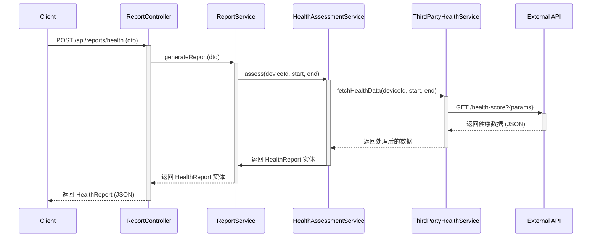

# 设计方案：集成第三方 API 的健康评估逻辑

本文档详细描述了将健康评估功能重构为依赖第三方 API 的技术设计。

## 1. 整体架构

重构后的架构将遵循关注点分离原则，引入一个专门的 `ThirdPartyHealthService` 来处理所有与外部 API 的交互。

**交互流程图:**

## 2. 组件设计

### 2.1. `ThirdPartyHealthService`

-   **文件路径**: `src/modules/report/third-party-health.service.ts`
-   **职责**:
    -   封装对第三方健康评估 API 的所有网络请求。
    -   处理认证、参数构建和基本的响应验证。
-   **核心方法**:
    -   `fetchHealthData(deviceId: string, startTime: Date, endTime: Date): Promise<any>`
        -   该方法将使用 NestJS 的 `HttpService` (`axios`) 向 `THIRD_PARTY_HP_API_URL` 发送 `GET` 请求。
        -   它会动态构建查询参数。
        -   利用 `firstValueFrom` 将 `Observable` 转换为 `Promise` 以便集成到 `async/await` 工作流中。
-   **依赖**:
    -   `HttpService` (`@nestjs/axios`)
    -   `ConfigService` (`@nestjs/config`)

### 2.2. `HealthAssessmentService`

-   **文件路径**: `src/modules/report/health-assessment.service.ts`
-   **职责**:
    -   作为健康评估的核心业务逻辑协调者。
    -   调用 `ThirdPartyHealthService` 获取外部数据。
    -   将外部 API 返回的数据结构 **适配** (Adapt) 为项目内部的 `HealthReport` 实体格式。
    -   不再包含任何直接的数据库查询或复杂的计算逻辑。
-   **依赖**:
    -   `ThirdPartyHealthService`

### 2.3. `ReportController` 和 DTO

-   **`GenerateHealthReportDto`**:
    -   **文件路径**: `src/modules/report/dto/generate-health-report.dto.ts`
    -   使用 `class-validator` 装饰器（如 `@IsString`, `@IsDateString`）来确保输入数据的格式正确性。
-   **`ReportController`**:
    -   修改 `POST /health` 端点的方法，使用 `@Body()` 装饰器接收并自动验证 `GenerateHealthReportDto`。

## 3. 错误处理

-   **第三方 API 请求失败**:
    -   当 `ThirdPartyHealthService` 中的 `HttpService` 调用失败时（例如，网络超时、5xx 错误），它会抛出一个标准的 `HttpException` (如 `BadGatewayException`)。
    -   此异常将被 NestJS 的全局异常过滤器捕获，并向客户端返回一个清晰的 5xx 错误响应。
-   **数据验证失败**:
    -   如果客户端请求的 `dto` 不符合 `GenerateHealthReportDto` 中定义的规则，`ValidationPipe` 会自动拦截请求，并返回一个 400 `BadRequestException`，其中包含详细的验证错误信息。

## 4. 配置管理

-   将在 `.env.example` 和开发环境的 `.env` 文件中定义 `THIRD_PARTY_HP_API_URL` 变量。
-   `app.config.ts` 会负责加载此变量，并通过 `ConfigService` 在应用范围内提供。这种方式可以确保 API 的 URL 在不同环境中（开发、测试、生产）可以被轻松切换，而无需修改代码。
