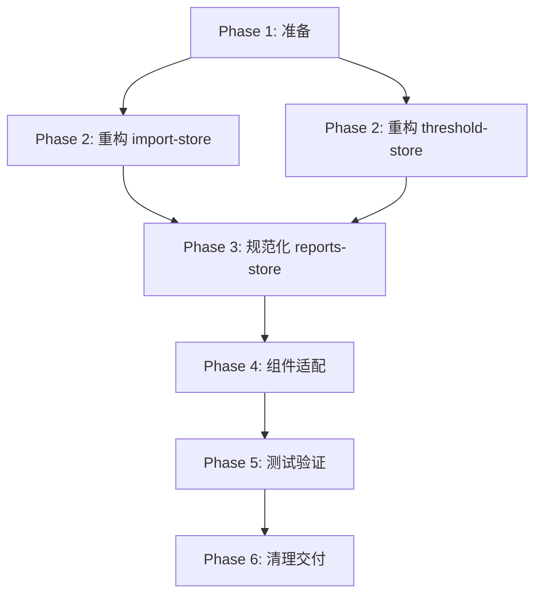

# 设计文档: 重构剩余 Store 模块的技术决策

## 1. 上下文 (Context)

### 1.1 背景

在模块化状态管理架构的第一阶段，我们成功将核心业务模块（auth, monitoring, alarms, equipment）重构为统一的 Zustand 架构。这些模块构成了系统的核心闭环：

```
用户登录 (auth) → 查看实时数据 (monitoring) → 接收告警 (alarms) → 查看设备详情 (equipment)
```

但项目中仍存在三个辅助模块使用不同的状态管理模式：

1. **import-store.ts** - Class-based 单例，1393行代码
2. **threshold-store.ts** - Class-based 单例，425行代码
3. **reports-store.ts** - 已使用 Zustand，但未遵循 State/Actions 分离规范

### 1.2 问题陈述

**架构不一致性**：
- 开发者需要理解并维护三种不同的状态管理模式
- 缺少统一的最佳实践和代码复用机制
- 新成员入职学习成本高

**技术债务**：
- Class-based store 缺少响应式更新机制（可能不触发 React 重渲染）
- `threshold-store` 需要手动绑定20个方法的 `this` 上下文
- `import-store` 代码过度设计，包含大量未使用功能

**性能隐患**：
- 缺少 Selector 优化，可能导致不必要的组件重渲染
- 状态订阅粒度过粗

### 1.3 利益相关者

- **前端开发团队**：需要统一的开发规范和维护模式
- **新成员**：需要清晰的架构文档和代码示例
- **产品团队**：需要确保功能稳定性和用户体验

## 2. 目标与非目标 (Goals / Non-Goals)

### 2.1 目标

1. **架构统一**：所有 Store 模块使用相同的 Zustand 架构模式
2. **代码简化**：将 `import-store` 从1393行简化到500-600行（减少60%）
3. **性能优化**：提供 Selector 导出，支持精确状态订阅
4. **维护性提升**：清晰的 State/Actions 接口分离，降低认知负荷
5. **向后兼容**：现有组件无需或仅需轻微调整即可使用新 Store

### 2.2 非目标

1. **功能增强**：不添加新业务功能（仅重构现有功能）
2. **UI 改造**：不改变用户界面和交互流程
3. **测试覆盖率**：不强制添加单元测试（如项目无测试基础设施）
4. **后端集成**：不修改 API 契约和数据格式

## 3. 技术决策 (Decisions)

### 3.1 决策一：为什么选择完全重构而非渐进式改造？

**选项对比**：

| 选项 | 优点 | 缺点 | 适用场景 |
|------|------|------|---------|
| **A. 完全重构** | - 彻底解决架构债务<br>- 代码质量提升明显<br>- 统一开发体验 | - 短期风险较高<br>- 需要充分测试 | 辅助模块，使用频率低，测试覆盖容易 |
| B. 渐进式包装 | - 风险较低<br>- 可逐步迁移 | - 技术债务持续存在<br>- 维护两套架构 | 核心模块，使用频率高，回归测试成本高 |
| C. 保持现状 | - 零风险<br>- 零成本 | - 架构不一致性持续<br>- 长期维护成本高 | 即将弃用的模块 |

**最终选择**：**选项 A - 完全重构**

**理由**：
1. **低频功能**：import, threshold, reports 都是低频辅助功能，重构风险可控
2. **架构差异大**：Class-based 与 Zustand 本质差异大，包装方案技术债务高
3. **长期收益**：统一架构降低长期维护成本，提升团队效率
4. **简化契机**：重构过程可以识别并移除过度设计的功能

### 3.2 决策二：import-store 简化原则

**现状分析**：

`import-store.ts` 包含以下功能模块（1393行）：

```
核心功能 (必须保留):
├── 文件上传 (uploadFile, uploadFileWithProgress)
├── 导入执行 (executeImport, retryImport)
├── 查询操作 (getRecords, getRecord)
└── 状态管理 (loading, error, pagination)

过度设计 (评估移除):
├── 批量导入作业管理 (executeBatchImport, batchJobs)
├── 模板管理 (getTemplates, createTemplate, updateTemplate, deleteTemplate)
├── 性能监控 (performanceMetrics, recordPerformanceMetric)
├── 缓存管理 (cache, getCachedData, setCachedData)
├── WebSocket 管理 (websocketStatus, subscribeToUpdates)
└── 统计报表 (statistics, historyStatistics, trendData)
```

**简化原则**：

1. **保留核心流程**：
   - 上传文件 → 预览数据 → 执行导入 → 查看结果
   - 状态管理（loading, error）
   - 基础分页和筛选

2. **移除未使用功能**：
   - 通过审查 `DataImportPage.tsx` 确认 UI 实际使用的功能
   - 移除所有未在 UI 中调用的方法和状态

3. **外置通用能力**：
   - **缓存管理** → 依赖 API 层面的 HTTP 缓存或 React Query（未来）
   - **性能监控** → 依赖全局错误监控系统（如 Sentry）
   - **WebSocket** → 依赖 `realtime-service` 统一管理

4. **目标行数**：500-600行（减少约60%代码）

**预期结构**：

```typescript
interface ImportState {
  // 核心数据
  records: ImportRecord[];
  currentRecord: ImportRecord | null;

  // 状态管理
  loading: boolean;
  error: string | null;
  uploadProgress: number;

  // 分页
  page: number;
  pageSize: number;
  total: number;
}

interface ImportActions {
  // 文件操作
  uploadFile: (request: DataImportRequest) => Promise<ImportRecord>;

  // 导入操作
  executeImport: (recordId: string) => Promise<ImportRecord>;
  retryImport: (recordId: string) => Promise<ImportRecord>;

  // 查询操作
  fetchRecords: (params?: QueryParams) => Promise<void>;
  getRecord: (recordId: string) => Promise<ImportRecord>;

  // 状态管理
  setLoading: (loading: boolean) => void;
  setError: (error: string | null) => void;
  reset: () => void;
}
```

### 3.3 决策三：Selector 导出策略

**选项对比**：

| 选项 | 示例代码 | 优点 | 缺点 |
|------|---------|------|------|
| **A. 命名导出对象** | `useImportSelector.records` | 类型安全<br>IDE 自动完成 | 需要额外维护 |
| B. 内联 Selector | `useStore(s => s.records)` | 灵活性高 | 重复代码<br>类型推断困难 |
| C. 不提供 Selector | `useStore()` | 简单直接 | 性能优化难 |

**最终选择**：**选项 A - 命名导出对象**

**示例**：

```typescript
export const useImportSelector = {
  records: (state: ImportState & ImportActions) => state.records,
  loading: (state: ImportState & ImportActions) => state.loading,
  uploadProgress: (state: ImportState & ImportActions) => state.uploadProgress,
  currentRecord: (state: ImportState & ImportActions) => state.currentRecord,
};

// 组件使用
const records = useImportStore(useImportSelector.records);
const loading = useImportStore(useImportSelector.loading);
```

**理由**：
1. **类型安全**：TypeScript 可以推断返回类型
2. **代码复用**：常用 Selector 可以在多个组件间共享
3. **IDE 友好**：自动完成和跳转定义
4. **性能监控**：可以在 Selector 中添加性能日志

### 3.4 决策四：错误处理策略

**统一错误处理模式**：

```typescript
// 所有异步 Actions 遵循相同模式
someAction: async (params) => {
  set({ loading: true, error: null });
  try {
    const data = await someService.someMethod(params);
    set({ data, loading: false });
  } catch (error) {
    const errorMessage = error instanceof Error
      ? error.message
      : '操作失败，请重试';
    set({ error: errorMessage, loading: false });

    // 可选：全局 toast 通知
    console.error('[Store Error]', error);
  }
}
```

**原则**：
1. **始终设置 loading 状态**：确保 UI 显示加载指示器
2. **捕获所有异常**：避免未捕获的 Promise 错误
3. **标准化错误消息**：提供用户友好的错误提示
4. **保留原始错误**：在控制台输出详细信息供调试

## 4. 风险与权衡 (Risks / Trade-offs)

### 4.1 风险矩阵

| 风险 | 可能性 | 影响 | 缓解措施 |
|------|--------|------|---------|
| **重构引入 Bug** | 中 | 高 | 充分手动测试，保留原文件作为参考 |
| **组件适配失败** | 低 | 中 | 重构前审查组件代码，记录使用模式 |
| **TypeScript 类型错误** | 中 | 中 | 渐进式重构，每完成一个 Store 立即验证 |
| **性能退化** | 低 | 低 | 使用 React DevTools Profiler 对比 |
| **功能遗漏** | 中 | 高 | 对比原代码逐个功能核对 |

### 4.2 权衡分析

#### 权衡一：简化 vs. 功能完整性

**选择**：优先简化，移除未使用功能

**理由**：
- ✅ 降低维护成本（少60%代码）
- ✅ 减少 Bug 表面积
- ✅ 提升代码可读性
- ⚠️ 未来如需恢复功能，可从 git 历史恢复

**回滚策略**：保留原文件的 git 历史，如需恢复功能可参考原实现

#### 权衡二：重构速度 vs. 测试覆盖

**选择**：优先重构速度，手动测试为主

**理由**：
- ✅ 项目无单元测试基础设施
- ✅ 辅助功能测试场景有限，手动测试可覆盖
- ✅ 快速交付统一架构
- ⚠️ 未来可考虑添加集成测试

**测试策略**：
1. 手动测试所有功能页面
2. 边界场景测试（空数据、错误处理）
3. 性能测试（React DevTools Profiler）

#### 权衡三：向后兼容 vs. 架构纯净

**选择**：优先向后兼容，保留导出签名

**理由**：
- ✅ 最小化组件改动
- ✅ 降低重构风险
- ✅ 渐进式迁移路径
- ⚠️ 可能保留部分非最优接口

**策略**：
```typescript
// 新接口（推荐）
export const useImportStore = create<ImportState & ImportActions>(...)

// 旧接口兼容（保留）
export const useImport = () => {
  const store = useImportStore();
  return {
    ...store,
    // 兼容旧的计算属性
    latestRecord: store.records[0] || null,
  };
};
```

## 5. 迁移计划 (Migration Plan)

### 5.1 迁移步骤



### 5.2 回滚计划

**触发条件**：
- 发现重构引入的严重 Bug
- 组件适配失败导致功能不可用
- TypeScript 类型错误无法在短时间内解决

**回滚步骤**：
1. 从 git 历史恢复原 Store 文件
2. 回滚所有组件改动
3. 验证功能恢复正常
4. 分析失败原因，调整重构策略

### 5.3 灰度发布（可选）

**策略**：
1. 在开发环境完成重构和测试
2. 在测试环境进行完整回归测试
3. 在生产环境观察错误监控（如 Sentry）
4. 如无异常，标记重构完成

## 6. 开放问题 (Open Questions)

### 6.1 需要在实施前确认的问题

1. **Q**: `import-store` 中的批量导入和模板管理功能是否在 UI 中实际使用？
   - **确认方式**：审查 `DataImportPage.tsx` 代码和产品需求文档
   - **影响**：决定是否可以移除这些功能

2. **Q**: 是否需要保留 WebSocket 实时更新功能？
   - **确认方式**：询问产品团队是否需要实时显示导入进度
   - **影响**：决定是否需要集成 `realtime-service`

3. **Q**: 项目是否计划引入单元测试框架（如 Vitest）？
   - **确认方式**：与技术负责人讨论
   - **影响**：决定测试策略（手动 vs. 自动化）

4. **Q**: 是否需要支持旧版浏览器？
   - **确认方式**：查看 browserslist 配置
   - **影响**：决定是否可以使用 ES2020+ 语法

### 6.2 实施中可能遇到的问题

1. **Q**: 组件依赖 Store 的未文档化行为
   - **缓解**：重构前详细审查组件代码，记录所有使用模式

2. **Q**: TypeScript 类型推断失败
   - **缓解**：使用显式类型注解，避免过度依赖推断

3. **Q**: 性能测试发现重渲染问题
   - **缓解**：使用 React.memo 和 Selector 优化

## 7. 成功指标 (Success Metrics)

### 7.1 代码质量指标

- [ ] 所有 Store 文件使用统一的 Zustand 架构
- [ ] TypeScript 编译零错误
- [ ] ESLint 零警告
- [ ] 代码行数减少60%（import-store）

### 7.2 功能验收指标

- [ ] 所有导入功能正常（上传、预览、执行、查询）
- [ ] 所有阈值配置功能正常（CRUD、测试）
- [ ] 所有报表功能正常（生成、下载、列表）

### 7.3 性能指标

- [ ] 组件重渲染次数减少（使用 Profiler 测量）
- [ ] 页面加载时间无明显变化
- [ ] 用户操作响应时间无明显变化

### 7.4 开发体验指标

- [ ] 新开发者可以在30分钟内理解 Store 架构
- [ ] IDE 类型提示和自动完成正常工作
- [ ] 代码审查通过（架构一致性）

## 8. 参考资料 (References)

- [Zustand 官方文档](https://docs.pmnd.rs/zustand/getting-started/introduction)
- [React 性能优化最佳实践](https://react.dev/learn/render-and-commit)
- [TypeScript 接口设计最佳实践](https://www.typescriptlang.org/docs/handbook/2/objects.html)
- 项目现有规范：`openspec/changes/modular-state-management/`
